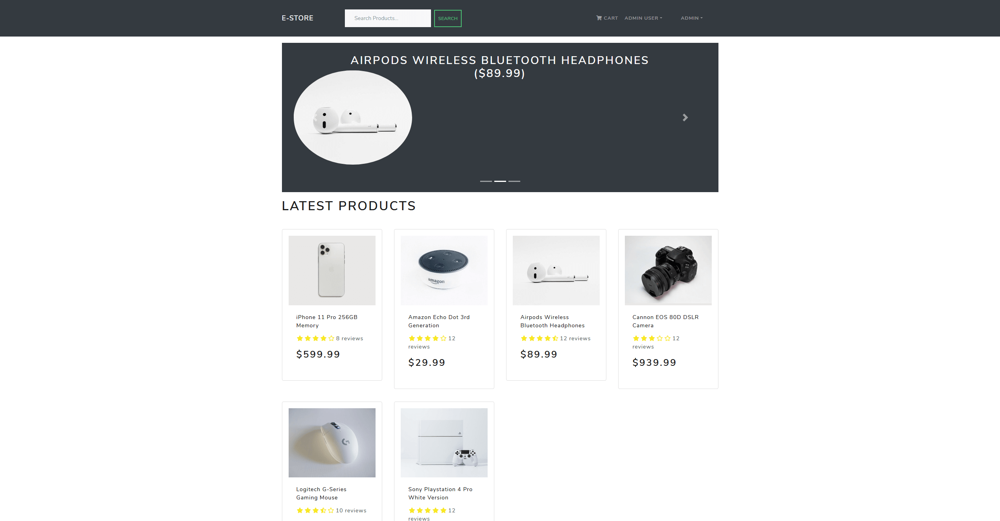

# E-STORE


A fully functional eCommerce mock store.
Features include shopping cart, product review/ratings, product pagination, user profile, order history, admin product
management, admin user management, admin order details, PayPal API integration, delivery pipeline, and database seeder.

[heroku-link](https://vast-shore-24517.herokuapp.com/)

## Installation

Run install to load dependencies. data scripts are for loading the seeder into MongoDB Compass.

```bash
npm install
npm run build
npm run data:import
npm run data:destory
```

## Usage

dev = development environment, start= server side server, server=nodemon server.js, client = react app or client side environment.

```bash
npm run dev
npm run start
npm run client
npm run server
```

## Contributing

Built with the help of Brad Traversy.

## License

[MIT](https://choosealicense.com/licenses/mit/)
